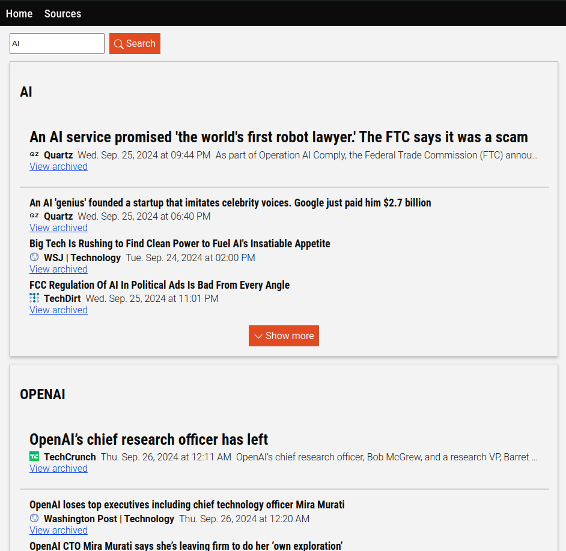

# Smart RSS Reader

## Introduction

RSS readers allow you to curate your own news and blog reading experience by choosing the RSS feeds that you like, giving you more choice than algorithmically-curated social media feeds. However, unlike social media, conventional RSS readers often provide you with a simple chronological list of stories instead of grouping or ranking them. The lack of ranking makes it hard to find the key stories of the day at a glance, while the lack of grouping makes it hard to find related stories to get a broader context and different perspectives.

This Smart RSS Reader addesses these flaws by intelligently grouping and ranking stories. It does so on the device hosting the web app; plus, with the help of threading, caching, and splitting stories into pages, it does so fairly quickly. It also allows you to search for stories intelligently, factoring in both keywords and semantic similarity.

The image below shows how the user interface looks. Note how the stories are related to the search term ("AI") and stories related to OpenAI are grouped together.  

This project succeeds a similar [previous project](https://github.com/JryHL/RSSReader) of mine. It improves on the performance with better utilization of threading and the splitting of stories into multiple pages. It also improves on the categorization and ranking logic by using vector embeddings and KMeans for semantic similarity.

## How to use

1. Use `git clone` to download the contents of this repository to your computer.
2. Ensure you have [Docker](https://docs.docker.com/desktop/) installed. 
3. Go to the root directory of this repository (the one with the docker files) and run `docker compose up --build` to launch the web application
4. You should be able to go to `localhost:5173` 

## Technical details

### The overall tech stack

The program contains a [Vue](https://vuejs.org/guide/introduction.html)-based front-end hosted on a [Node.js](https://nodejs.org/en/learn/getting-started/introduction-to-nodejs) server and a [Python](https://www.python.org/) and [Flask](https://flask.palletsprojects.com/en/3.0.x/) based backend that communicate with each-other with REST requests. [SQLite](https://www.sqlite.org/) is used to persist RSS source names and URLs.

###  How the stories are categorized
The RSS Reader uses [Sentence Transformers](https://sbert.net/index.html) with the [all-MiniLM-L6-v2](https://huggingface.co/sentence-transformers/all-MiniLM-L6-v2) model to turn news headlines into embedding vectors representing their meaning, and then uses [KMeans](https://scikit-learn.org/stable/modules/generated/sklearn.cluster.KMeans.html) with [scikit-learn](https://scikit-learn.org/stable/index.html) to group them together based on similarity. Then, it compares the headline embeddings with both a preset list of category labels and common words from the headlines themselves to assign a label to each category. 

### How the stories and categories are ranked
Many factors go into ranking the stories. Stories are assigned an inital rank based on how new they are. Then, their ranking is increased based on how semantically similar they are to words like "emergency" or "disaster" in order to increase the ranking of critical stories. When stories are grouped into categories, their ranking is also influenced by how semantically related they are to the category's label; this helps de-emphasize less relevant stories that are wrongly included in a category by KMeans. 

Categories themselves are ranked based on the sum of the ranks of their constitutent stories. This helps prioritize more important categories—those with recent stories or a large number of stories. It also helps penalize categories with too many irrelevant stories. 

### How I enhanced the performance

I used Python's threading features to fetch several RSS feeds simultaneously: the main source of latency when fetching RSS feeds is the network response time, and threading prevents one feed from blocking another. Since multithreading also introduces performance overheads, many performance-intensive features that aren't affected by I/O blocking are instead done in a single thread.

I also used caching to ensure that RSS feeds that have already been fetched in the past few minutes do not need to be fetched again. This means that the latency for getting stories is reduced once the feeds have been fetched for the first time.

Finally, I made sure that when many stories have been fetched, only part of the stories are shown to the user, and more stories can be found by clicking on a "Show More" button. This helps reduce the load associated with categorizing stories. The stories with the highest ranking (most recent stories) are shown first, reducing the need for subsequent clicks on "Show More". 

